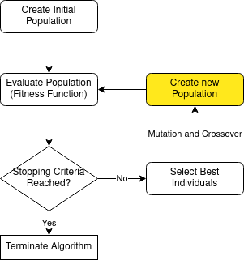
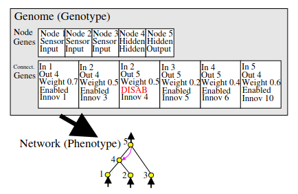
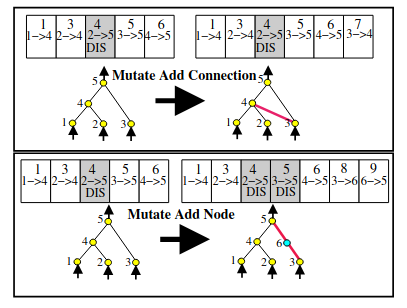

class: center, middle
# Quick Overview of Genetic Programming
Claus Aranha, 2022-11-15


---
# Lecture Outline

In this lecture we study the concept of .redtext[Genetic Programming (GP)].

First we will learn the basic concepts of GP, and some simple code examples.

Then, we study modern implementations of GP, which are used to design
the architecture of Neural Networks.

Finally, we will see a example of contemporary research using GP.

## Topics for Today:

- What is Genetic Programming?
- Implementation of Simple GP
- Simple GP and the Pole Balancing Problem
- GP for Neural Networks (NEAT)
- GP for Morphology

---
# 1. What is Genetic Programming?
## Mini Intro to Evolutionary Computation

Evolutionary Computation (EC) is the idea of **using the mechanism of
Natural Evolution to create computational systems.**

In nature, living creatures adapt to their environment through **natural
selection**, **genetic inheritance**, and **mutation**. These mechanisms
resulted in the large diversity of living beings that we have today.

Could we use a similar idea to create interesting and powerful computer programs?


.boxyellow[
.boxlabel[Many Techniques based in Evolutionary Computation have been developed since 1980s]

.cols[
.c50[
- Genetic Algorithms (GA)
- Evolution Strategies (ES)

]
.c50[
- Differencial Evolution (DE)
- Genetic Programming (GP)
]
]
]
---
# 1. What is Genetic Programming?
## When do we want to use Evolutionary Computation?

EC Methods have found to be useful for solving real problems with the following characteristics:

- It is difficult to calculate a solution, but it is easy to evaluate a solution.  
(NP-hard problems)

- The solution space is discontinuous, and/or very high dimensional.

- We are interested in creative and unusual solutions.

.boxyellow[
.boxlabel[Creating Programs with Evolutionary Computation]

Creating computer programs has all these characteristics: It is hard to create
a program, but it is easier to test an existing program. The task is
symbolic / discontinuous, and usually requires a lot of human creativity.

Because of this, there is a lot of interest in using Evolutionary Computation for
creating computer code.
]

---
# 1. What is Genetic Programming?
## Outline of an EC Method

.cols[
.c50[
**General Evolutionary Computation Algorithm:**

.center[]

]
.c50[
Evolutionary Computation methods follow the algorithm to the left.

To implement an EC, it is necessary to define:
- How to generate a random solution (Encoding)

- How to evaluate a solution (Fitness)

- How to generate new solutions (mutation/crossover)

]
]

<!-- TODO: Write a bit more about why EC is used a lot. -->

---
# 1. What is Genetic Programming?
## Evolutionary Computation for creating Programs

> **Genetic Programming** is an Evolutionary Computation Method that is used to generate computer programs.

### Three Key Questions in Genetic Programming:

1. How to represent a program as a genome:  
.redtext[The choice of data structure is important. Can we create valid random programs in this data structure? Is the data structure flexible? How to represent loops/conditionals/subroutines?]

2. How to mutate/crossover a program:  
.redtext[How to deal with programs of different lengths. Will mutation/crossover break a program? Can we extract "functions" for mutation/crossover?]

3. How to evaluate a program:  
.redtext[Comparison of input/output. However, multiple, possibly infinite, input/output pairs. Stochastic input/output pairs]

---
# 1. What is Genetic Programming?
## Introduction of the "Simple GP"

The "traditional" GP (Simple GP) .redtext[represents programs as a **Tree Graph**].  
In this graph, the **leaf nodes are the input** and the **root node is the output**.

.cols[
.c70[
The tree to the right is equivalent to the following program:

`mul(neg(add(mul(X, mul(X, X)), X)), sub(-1, X))`

Which we can simplify as:

`y = (-1 * (X + X^3)) * (-1 - X)`

or, equivalently:

`y = X + X^2 + X^3 + X^4 `

**Note that any subtree is a valid GP tree!**

]
.c30[


]
]

---
# 1. What is Genetic Programming?
## Terminals and Operators in Simple GP

To create the Simple GP tree, first we need to define the **Terminals**
and the **Operators**.


### Terminals:
Terminals include the inputs of the program, as well as fixed value constants.

 

### Operators:
Operators have an **arity**, which is the number of inputs that they require.

  

---
# 1. What is Genetic Programming?
## The choice of operators and terminals is important!

This choice depends on the problem you are trying to solve, but it also affects your **search space**.

- If the number of operators is very small, then maybe it is not possible for
the GP to create the program that you need.

- If the number of operators is very large, then maybe it takes too much time for
the GP to find the correct program. (Because there are too many options)

Because of this, it is very important to consider the operators carefully.

---
# 1. What is Genetic Programming
## The Evolutionary Loop in Simple GP

After we defined the operators and terminals, the evolutionary loop in GP is very similar to the evolutionary loop in other algorithms, like Genetic Algorithms (GA).

.cols[
.c50[
### 1. Generate the Initial Population

There are two common options:

- **Random tree**: Each node is selected with equal probability from terminals and operators.

- **Full tree**: Nodes are selected from operators until a target tree size is reached, and after that, nodes are selected from terminals.

]
.c50[
.center[]
]
]

---
# 1. What is Genetic Programming
## The Evolutionary Loop in Simple GP

After we defined the operators and terminals, the evolutionary loop in GP is very similar to the evolutionary loop in other algorithms, like Genetic Algorithms (GA).

.cols[
.c50[
### 2. Evaluate the population

To evaluate the population, you execute each GP program tree on a set of inputs.

Calculate the fitness as the difference between the output of the GP and the expected output.

Make sure you have enough input/output pairs to evaluate the correctness of your GP.
]
.c50[
.center[]
]
]

---
# 1. What is Genetic Programming
## The Evolutionary Loop in Simple GP

After we defined the operators and terminals, the evolutionary loop in GP is very similar to the evolutionary loop in other algorithms, like Genetic Algorithms (GA).

.cols[
.c50[
### 3. Select Best Individuals

To select the best individuals for the next population set, we use traditional methods from the EC literature:

- **k-Tournament**: *k* individuals are selected at random from the population, and the best one is kept.

- **Roulette Wheel**: Select an individual from the entire population, weighted by fitness value.

]
.c50[
.center[]
]
]

---
# 1. What is Genetic Programming
## The Evolutionary Loop in Simple GP

After we defined the operators and terminals, the evolutionary loop in GP is very similar to the evolutionary loop in other algorithms, like Genetic Algorithms (GA).

.cols[
.c50[
### 4. Create a new population

Use crossover and mutation to create a new population:

**Crossover**: Exchange a subtree between two individuals.

**Mutation**: Delete a subtree and replace it with a random tree.

]
.c50[
.center[]
]
]

---
# 1. What is Genetic Programming
## Crossover in GP

.center[

]

---
# 1. What is Genetic Programming (Summary)

- Simple GP is a technique to create programs using Evolutionary Computation

- The hard part about GP is **how to represent a program**

  - Tree Structure

  - Choice of **Operators** and **Terminals**

- The Genetic Loop of GP is similar to the Genetic Loop of GA / EC / Etc.

  - Mutation and crossover are specialized.

  - Fitness Evaluation must use Input/Output pairs

### Next I will show the implementation of GP -- Any questions so far?

---
# 2. Implementation of Simple GP
## Let's get Coding!

In this section, I will show how to program a Simple GP.

You can follow the code here:  
https://github.com/caranha/GP-short-tutorial


---
# 2. Implementation of Simple GP
## DEAP - Distributed Evolutionary Algorihtms in Python

We use the [DEAP](https://deap.readthedocs.io/en/master/) Library to program simple GP in python.


---
# 2. Implementation of Simple GP
## How to use the DEAP Library

First, we will show how to use the DEAP library to program a Simple GP.

- A Jupyter Notebook contains the necessary code examples.

- You can find the Jupyter Notebook in the file: `code/01_SimpleGP/GP_HowTo.ipynb`

- Don't forget to install the requirements listed in `code/outline.md`

.redtext[Let's take a look at this Jupyter Notebook.]

---
# 2. Implementation of Simple GP
## A Full Example of Simple GP

Next, we show a full example of Simple GP that solves three toy problems:

- **Symbolic Regression**: Given a Real valued `x`, calculate `x + x^2 + x^3 + x^4`


- **Fibonacci**: Given an integer `N`, calculate the N-th Fibonacci number.


- **Parity**: Given a string of `N` bits, calculate the parity of the string.

The code for this example is in the file: `code/01_SimpleGP/Simple_GP.py`

.redtext[Let's take a look at this code!]

---
# 2. Implementation of Simple GP
## GP Issues: GP does not always succeed!

The Simple GP finds good results for the `symbreg` and `parity` problems.
However, it could not find a good result for `fibonacci`.

How can we improve the result of fibonacci?

1. **Improve the operator set: Remove sin/cos, add square root.**  
(The closed form of fibonacci uses square root)

2. **Choose better algorithm parameters.**  
(EC performance depends on crossover, mutation, etc.)

3. **Add the ability of recursion or loop in the GP.**  
(Recursion and loop are difficult in Simple GP. A more advanced encoding
  is necessary)

---
# 2. Implementation of Simple GP
## GP Issues: Bloat

.cols[
.c60[
GP can solve the `symbreg` in 40 generations.

However, if we keep running the evolution, the best tree will tend to
become larger and larger, without improving the quality of the solution.

This is called .redtext[bloat]. Bloat can cause the GP to become much slower,
and remove the effectiveness of mutation and crossover.

Reducing bloat is an important research question in GP.
]
.c40[
.center[

]
]
]

---
# 2. Implementation of Simple GP (Summary)

- We can use the DEAP library to implement Simple GP;

- Deap define key functions in the `toolbox` object;

- Code for toy problems: symbolic regression, fibonacci, parity;

- Selection of operators and parameters matter for performance.

- Beware of bloat!

### Next we will see a more interesting application example. -- Any Questions so Far?

---
# 3. Simple GP and the Pole Balancing Problem
## The OpemAI Gym "Classic Control" Library

The [Classic Control](https://www.gymlibrary.dev/environments/classic_control/)
library from OpenAI offers several simple, animated simulations for
controllers.

Although this library was originally developed for Reinforcement Learning,
we can check how easy or hard it is to solve these problems using GP.

.cols[
.c50[
.center[

]
]
.c50[
.center[

]
]
]

---
# 3. Simple GP and the Pole Balancing Problem
## Description of the two problems

.cols[
.c50[
**Cart Pole Balancing**:
- Objective: Keep the pole standing as long as possible.
- Inputs: Position, speed, angle, angular speed.
- Outputs: 0- Push left, 1- Push right.

.center[

]
]

.c50[
**Mountain Car**:
- Objective: Make the car reach the top with minimum pushes.
- Inputs: Position, speed.
- Outputs: 0- Push left, 1- Push right.

.center[

]
]
]


---
# 3. Simple GP and the Pole Balancing Problem
## Simulation and Stochastic Fitness

For these two problems, the initial state is random.

This means that the result of a program changes,
depending on the start state.

**To avoid the influence of a "lucky" start, the fitness must be
calculated from several simulations.**

```python
reps = 3

def eval_cartpole(func):
    fitness = 0
    for i in range(reps):
        fitness += eval_cartpole_inside(func)

    return fitness,
```

This situation is described in the literature as
.redtext[noisy fitness function].

---
# 3. Simple GP and the Pole Balancing Problem
## Evolving the GP for the Pole Balancing Problem.

The following two files run the GP for the pole balancing and the mountain car
problems. The code is very similar to the Toy problems, except for the noisy
fitness, and small changes to the operator set.

- `02_PoleBalancing/PoleBalance_GP.py`
- `02_PoleBalancing/MountainCar_GP.py`

Also, the following two files can be used to observe the performance of the
best (or worst) program generated by GP:

- `02_PoleBalancing/PoleBalance_GPview.py`
- `02_PoleBalancing/MountainCar_GPview.py`

Let's run these programs and see the results.

---
# 3. Simple GP and the Pole Balancing Problem
## Analyzing the Results

- Running the Simulation Takes much more time!
  - We want to run multiple simulations in Parallel.
  - We also want to avoid running unnecessary simulations.

- Selecting Operators:
  - "Protected Division" operator was not helping.

- Results:
  - OK for Pole Balancing, not OK for Mountain Car.
  - Not pushing the car at all in mountain car has better fitness than trying and failing.

### How can we improve on this result? We will see another algorithm later.  
### Any questions?

---
# 4. GP for Neural Networks
## Can we use GP for Neural Networks?

Simple GPs are represented as a tree graph. Neural networks are also (usually) represented as a tree graph. So, it is natural to ask, **Can we use GP to create Neural Networks?**.

Using GP to create neural networks would solve many problems about how to design their topology, so it is a very interesting question.

However, there are some issues that need to be addressed:

- **What are the appropriate operators and terminals for a GP-NN?**

- **How to select the weights of a GP-NN?**  
  (This is an important, and hard, issue. Do we improve the weights using the evolutionary process, or separately?)

---
# 4. GP for Neural Networks
## Neuro Evolution of Augmenting Topologies (NEAT)

NEAT ([Original Paper](https://nn.cs.utexas.edu/downloads/papers/stanley.cec02.pdf)) is an algorithm originally proposed in 2003 to generate Neural Networks using Genetic Programming.

Today NEAT (and its variants, like HyperNEAT, CPPN, and others) is the
de-facto standard for what is called .redtext["Neuroevolution"] --
The evolution of artificial neural networks.

Let's see how NEAT works.

---
# 4. GP for Neural Networks
## NEAT Program Encoding

.cols[
.c50[

]
.c50[
Neat Defines a GP tree as a .redtext[directed graph]. Each neuron is represented as a node on a graph, and connections are represented as edges.

Each node has an associated **activation function**. Users define the set of possible activation functions in the same way that GP defines the set of operators.

NEAT focuses on the **edges** of the neural network. Each edge that is created is associated with a **unique number ID** (*innovation number*), which is used for crossover and mutation later.

Edges also have weight values, and a flag indicating whether they are enabled or disabled.
]
]

---
# 4. GP for Neural Networks
## NEAT Mutation

.cols[
.c50[

]
.c50[
Mutation in NEAT is relatively straightforward. There are two types of mutation:

- **Edge Mutation**: A new edge is created between two existing nodes. The global *innovation number* is incremented.

- **Node Mutation**: A new node is inserted between two existing nodes. The edge between them is disabled (not deleted), and two new edges are created.
]
]

---
# 4. GP for Neural Networks
## NEAT Crossover

.cols[
.c60[
Different from GP, .redtext[a subgraph of a Neural Network is not a complete neural network], so it is not possible to use the traditional GP crossover operators.

**NEAT solves this problem using the Innovation Numbers**.

The edges of two neural network are aligned by their innovation numbers. After that, the crossover is similar to the Genetic Algorithm crossover.

]
.c40[

]
]

---
# 4. GP for Neural Networks
## NEAT -- Other characteristics

A few other interesting characteristics of the NEAT algorithm:

- **Genetic Species**:  
NEAT calculates the species of a Neural Network, based its lineage relationships and the distance between two networks.

This information is used during the **selection** process, to maintain the **diversity** of the population.

`Diversity is the amount of variety existing in the population of an Evolutionary computation. In general high diversity improves the performance of the algorithm.`

- **Start with Empty Networks**:  
The initial population of a NEAT algorithm contains only empty networks. These networks have only input and output neurons (no hidden neurons), and few connections.

It is believed that this improves the speed of the algorithm, and help reduce bloat.

---
# 4. GP for Neural Networks
## Code Example 1: NEAT for Pole Balancing

We can re-do the OpenAI Gym Pole Balancing exercise using Neat by executing the following two files:

Evolve a solution for the problem:
- `03_Neat/single-pole-balancing-openai/evolve-feedforward.py`

Observe the best solution:
- `03_Neat/single-pole-balancing-openai/test-feedforward.py`

This program is more advanced, including things such as:
- parallelization,
- graph of fitness over time,
- saving the best individual to a file,
- graph of species, etc.

Make sure to look at the details later!

---
# 4. GP for Neural Networks
## (Extra) The Bibites

To finish this section, I want to introduce a fun project that uses NEAT: [The Bibites](https://leocaussan.itch.io/the-bibites)

.center[

]

In this project, artificial creatures are evolved in a simulated world. Their brains are controlled by the NEAT algorithm.

In the beginning, these creatures can only move foward. But after some time, they learn to search for food, save energy, and hunt (or flee) from other creatures.

## Take a look later! Any questions about NEAT?

---
# 5. GP and Morphology

Just like the genome is the program that generate our bodies,
is it possible for a GP program to *create* new things?

In this last part, we will look at some research and code about GP being
for creating structures (morphology)

---
# 5. GP and Morphology
## NEAT-CPPN for image generation.

2D image generation example.

---
# 5. GP for Morphology
## Image Generation and

CPPN and Image Generation


---
# 5. GP for Morphology
##

Fabio Presentation

---
# 6. Summary
- Things we learned:
- Things you should try to do:

---
# A. References

- [DEAP library for simple GP](https://deap.readthedocs.io/en/master/tutorials/advanced/gp.html)
- [OpenAI Gym Classic Control Problems](https://www.gymlibrary.dev/environments/classic_control/)
- [NEAT Library](https://neat-python.readthedocs.io/en/latest/neat_overview.html)
- [NEAT Paper](http://nn.cs.utexas.edu/downloads/papers/stanley.cec02.pdf)
- [Soft Robot Morphology Code](https://github.com/fhtanaka/SGR)
